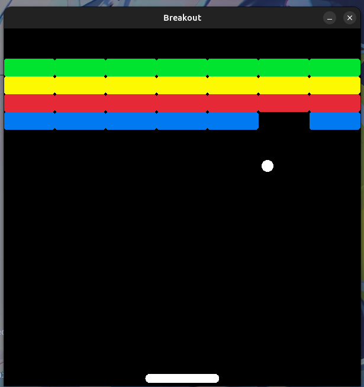

# Breakout
Breakout recreation using C++ and the Raylib library



# Build Instructions
```bash
# Clone the repository
git clone https://github.com/<Slynxh07>/Breakout.git
cd Breakout

# Create build directory
mkdir build && cd build

# Configure and build
cmake ..
cmake --build .
```
# Project Structure

```bash
Breakout/
├── include/          # Header files (.h)
├── src/              # Source files (.cpp)
├── build/            # Build files
├── CMakeLists.txt    # CMake build config
├── .gitignore
└── README.md

# After building, the executable will be inside the build/ folder:
./Breakout
```

# Requirements

CMake ≥ 3.10
C++17 compatible compiler (GCC, Clang, or MSVC)